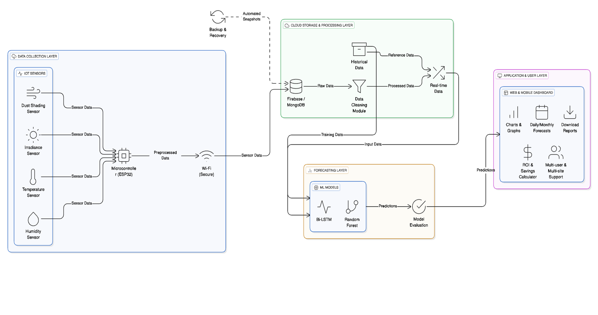

# Smart Solar Advisor
## Smart Solar Advisor: IoT-Enabled System with AI-Based Fault Detection and Guidance

**Project ID:** 25-26J-527

---

## Research Topic

Smart Solar Advisor is an intelligent, IoT-enabled solar energy management system that leverages hybrid machine learning models, real-time sensor monitoring, and advanced AI technologies to provide comprehensive solar energy forecasting, anomaly detection, and intelligent consultation services. The system integrates multiple components to deliver accurate predictions, fault detection, and user-friendly interactions for solar energy systems in Sri Lanka.

The research focuses on developing a holistic solution that combines:
- **Real-time IoT sensor integration** for continuous monitoring
- **Anomaly detection algorithms** for proactive fault identification
- **LLM-powered conversational AI** for domain-specific solar energy consultation
- **Location-aware prediction models** using hybrid ML approaches (KNN + XGBoost)

---

## Research Description

Smart Solar Advisor is a comprehensive research project that proposes an IoT-enabled and AI-driven system to support solar energy planning, monitoring, and decision-making in Sri Lanka. The research addresses key limitations in existing solar solutions by combining site-specific environmental sensing, machine learning-based forecasting, intelligent fault detection, location-aware prediction, and an AI-powered conversational assistant. The system is designed to support users across the full solar lifecycle, from pre-installation feasibility analysis to operational monitoring and user guidance.

---

## Research Objectives

### Main Objective
To develop an intelligent, IoT-based solar advisory system that uses real-time environmental data and advanced AI techniques to accurately forecast solar energy generation, detect system faults, and provide reliable user guidance.

### Specific Objectives
- To collect site-specific environmental data using IoT sensors prior to solar installation.
- To predict daily and monthly solar energy generation (kWh) using hybrid machine learning models.
- To detect anomalies and faults in solar panel and inverter performance using machine learning.
- To improve prediction accuracy in data-scarce regions using nearby site-based and location-aware modeling.
- To provide intelligent, domain-specific solar consultation using an LLM-powered chatbot.
- To present predictions, system status, and insights through user-friendly web and mobile dashboards.

---

## Research Team

- **S.C. Dilshan (IT22118318)**  
  Component: IoT-based Monthly and Daily Solar Energy Prediction System  

- **L.A.V.U. Liyanaarachchi (IT22120502)**  
  Component: LLM-Powered Solar Chatbot with Retrieval-Augmented Generation (RAG)  

- **K.G.L. Madusarani (IT22569868)**  
  Component: AI-Based Anomaly Fault Detection Module for Solar Systems  

- **K. Rangana Malmi Nadee (IT22341204)**  
  Component: Nearby Site-Based and Location-Aware Solar Energy Forecasting System  

---

## Supervisors

- **Supervisor:** Mrs. Thilini Jayalath  
- **Co-Supervisor:** Mr. Nushkan Nismi  

---

## Problem Statement and Solutions

### Problem Statement
Despite the growing adoption of solar energy in Sri Lanka, users face major challenges when planning and managing solar PV systems. Existing tools rely on generalized weather or satellite data, which ignore site-specific factors such as microclimate variations, dust accumulation, and shading. As a result, users cannot accurately estimate monthly energy generation before installation. Additionally, most systems lack intelligent fault detection, provide limited decision support, and do not offer accessible guidance for non-technical users. These gaps lead to poor investment decisions, undetected performance losses, and reduced user confidence in solar technology.

### Proposed Solutions
The Smart Solar Advisor addresses these challenges through an integrated, multi-component approach:

- **IoT-Based Pre-Installation Forecasting:**  
  Collects real environmental data at the site before installation to generate accurate daily and monthly energy predictions.

- **AI-Based Anomaly Fault Detection:**  
  Uses machine learning models to detect faults such as panel degradation, wiring issues, and partial shading in real time.

- **Location-Aware Nearby Site Forecasting:**  
  Improves prediction accuracy in areas with limited data by learning from geographically and climatically similar solar installations.

- **LLM-Powered Solar Chatbot:**  
  Provides reliable, domain-specific solar guidance using retrieval-augmented generation, ensuring accurate and explainable responses.

Together, these solutions form a unified intelligent system that enhances accuracy, transparency, and user trust across the solar energy lifecycle.

## System Overview Diagram




## System Components

### 1. Monthly Unit Prediction System

An IoT-based solar energy prediction system that collects real environmental data at the site before installation and uses machine learning models to estimate daily and monthly solar energy generation in kilowatt-hours (kWh).

**Key Features:**
### Key Features

- **Pre-installation solar energy forecasting**  
  Predicts daily and monthly solar energy generation (kWh) before panel installation using site-specific environmental data.

- **Real-time IoT sensor data collection**  
  Collects live environmental parameters such as solar irradiance, temperature, dust level, and rainfall through an ESP32-based IoT device.

- **Cloud-based data storage and processing**  
  Securely stores real-time and historical sensor data to support continuous monitoring and long-term analysis.

- **30-day monitoring period tracking**  
  Tracks completed and remaining days in the monitoring cycle, helping users understand data collection progress toward monthly prediction.

- **Day-by-day progress visualization**  
  Displays daily data availability and system status through progress charts for better transparency and trend analysis.

- **Device status monitoring**  
  Shows device active or inactive status and last sensor reading time to quickly identify connectivity or power issues.

- **Hybrid machine learning prediction engine**  
  Uses regression-based ML models to learn from real environmental data and generate accurate energy forecasts.

- **User-friendly dashboard interface**  
  Presents predictions, progress indicators, and historical trends in a clear and easy-to-understand format for non-technical users.

- **Report generation for decision-making**  
  Enables users to review daily and monthly summaries to support solar investment and system sizing decisions.


## IoT Device Description

The Smart Solar Advisor IoT device is a custom-built, low-cost environmental monitoring unit designed to collect real-world site data **before solar panel installation**. The device operates independently and continuously records environmental conditions that directly affect solar energy generation.

The device is installed at the proposed solar installation site and acts as the primary data source for accurate daily and monthly energy forecasting.

### Device Purpose
- Capture **site-specific environmental conditions**
- Eliminate reliance on generalized weather or satellite-only data
- Provide reliable inputs for machine learning–based solar energy prediction
- Enable progress tracking and device health monitoring

---

## Hardware Components

- **ESP32 Microcontroller**  
  Acts as the central controller with built-in Wi-Fi for real-time data transmission.

- **BH1750 Light Sensors (×2)**  
  Measure solar irradiance to capture sunlight intensity accurately.

- **DHT22 Sensors (×2)**  
  Measure ambient temperature and humidity affecting panel efficiency.

- **GP2Y1010AU0F Dust Sensor (×1)**  
  Detects dust accumulation, a major factor in solar performance degradation.

- **Rain Sensors (×2)**  
  Detect rainfall events that influence irradiance and dust conditions.

- **Power Management System**  
  Includes battery pack, charging module, and BMS for stable outdoor operation.

- **Weatherproof Enclosure**  
  Protects electronics from rain, dust, and direct sunlight for long-term outdoor use.

---

## Device Functionality

1. Sensors collect environmental readings at fixed intervals.
2. ESP32 aggregates sensor values and performs basic validation.
3. Data is transmitted securely to the cloud server via Wi-Fi.
4. The backend stores readings for processing and prediction.
5. Device status and last reading time are reflected on the user dashboard.

---

## IoT Device Photo


*Figure: Custom-built IoT device used for collecting environmental data prior to solar installation.*

---

## Device Deployment Notes

- The device should be mounted in an **unshaded, open area** near the planned panel location.
- Orientation should allow accurate sunlight exposure.
- Stable Wi-Fi or GSM connectivity is required for continuous data logging.
- The device operates autonomously once powered on.


**Technologies:**
- Backend: Node.js (Express)
- Frontend: React.js
- Mobile App: React Native
- Database: Firebase
- API: REST API
- Engine: Python


---

## Installation & Run Instructions

### Backend (Node.js API)

```bash
cd SmartSolarUnit/SmartSolar_Backend
npm install
nodemon server.js
```

---

### Frontend (React.js Web App)

```bash
cd SmartSolarUnit/SmartSolar_WebApp
npm install
npm run dev
```

---

### Mobile App (React Native)

```bash
cd SmartSolarUnit/SmartSolarApp
npm install
# For iOS
npx react-native run-android
# For Android
npx react-native run-ios
```

---

### Python Engine (Prediction/Simulation Engine)

```bash
cd SmartSolarUnit/solar_python_engine
# Activate virtual environment (if using venv)
source venv/bin/activate  # On macOS/Linux
# or
venv\Scripts\activate     # On Windows

pip install -r requirements.txt

# Run the prediction engine
python main.py

```

---

**Location:** `SmartSolarUnit/`

---

### 2. Anomaly Fault Detection Module

An intelligent fault detection system that monitors solar panel performance in real-time and identifies anomalies, faults, and performance degradation using machine learning algorithms.

**Key Features:**
-AI-based Anomaly Fault Detection using a Random Forest machine learning model
-Real-time analysis of inverter data to detect performance deviations instantly
-Benchmark dataset comparison using validated South Asian solar PV data
-Accurate fault classification including partial shading, panel degradation, and wiring faults
-Predictive maintenance support through early fault identification
-Dashboard-based fault visualization for easy monitoring and decision-making
-Historical fault logging and report generation for performance analysis
-Automated alert notifications for detected anomalies

**Technologies:**
Machine Learning & Data Processing

-Python – Data preprocessing and machine learning model development
-Scikit-learn – Random Forest model implementation and evaluation
-Pandas & NumPy – Data cleaning, transformation, and feature analysis

Backend & Data Management

-Node.js – Backend services for data handling and API integration
-Heyleys Inverter API – Real-time solar inverter data retrieval
-MongoDB – Storage of real-time data, benchmark datasets, and fault logs

Frontend & Visualization

-React.js – Dashboard interface for real-time monitoring
-Chart.js / Recharts – Visualization of faults, trends, and anomalies

Communication & Security

-REST APIs (HTTPS) – Secure data transmission
-JWT / Role-based access control – Secure dashboard access


---

## Installation & Run Instructions

### Backend (Node.js API)

```bash
cd FaultDetection/backend
npm install
npm run dev 
```

---

### Frontend (React.js Web App)

```bash
cd FaultDetection/frontend
npm install
npm start
```

**Location:** `FaultDetection/`

---

### 3. LLM-Powered Solar Chatbot

A domain-specific conversational AI assistant powered by Retrieval-Augmented Generation (RAG) technology, providing intelligent solar energy consultation in both Sinhala and English.

- RAG (Retrieval-Augmented Generation) System
- Multi-Source Data Integration
- Multiple Application Modes
- Data Processing Pipeline

**Technologies:**
- LLM Integration
- Vector Databases
- Embeddings

---

## Installation & Run Instructions
```bash
# Navigate to project
cd C:\Users\vihan\OneDrive\Desktop\Projects\SmartSolarAdvisor_25-26J-527\Chatbot

# Activate virtual environment
.\.venv\Scripts\Activate.ps1

# Install dependencies
pip install -r requirements.txt

# Process data (after adding files to data/ folders)
python run_pipeline.py

# Test search
python test_search.py

# Run web app
python -m streamlit run app_simple.py

# Stop app
Ctrl + C

```


**Location:** `Chatbot/`

---

#### 4. Nearby Site-Based Forecasting

The IoT-Enabled Hybrid ML for Location-Aware Solar Prediction system estimates solar energy potential for any selected location using a combination of:

  - Hybrid machine learning models (Weighted KNN + XGBoost)
  - IoT-based solar monitoring
  - GIS-based interactive map selection
This system enables accurate solar predictions even in data-scarce regions by integrating satellite irradiance data with real-time environmental inputs.

System Integration Overview

The solution integrates the following components:
XGBoost-based predictive modeling for high-accuracy regression
NASA POWER Solar Irradiance API for satellite-derived solar data
Interactive map-based coordinates
IoT device simulation for real-time irradiance and temperature data
Roof-based feature engineering, including:
   Tilt angle
   Direction (azimuth)
   Orientation score
   Roof area

**Key Features:**
 1.Interactive Map Location Selection
- Users can click any geographic location on the map
- Latitude and longitude are automatically extracted and populated

2.Automatic Solar Irradiance Fetching
- Fetches 30-day average solar irradiance using the NASA POWER API
- Converts irradiance values into kWh/m²/day with proper unit normalization

3.Hybrid ML Model
- Combines:
   KNN (30%) – captures spatial similarity using nearby locations
   XGBoost (70%) – models nonlinear relationships and complex interaction
   Inputs:
    - Latitude
    - Longitude
    - Roof area
    -  Panel efficiency
    -  Tilt
    -  Direction
    -  Orientation score
    -  Solar irradiance
  Output:
   - Predicted daily solar energy generation (kWh/day)

4.IoT Data Integration
- Simulated IoT sensors provide:

Real-time solar irradiance

Ambient temperature

Enables short-term (5-minute interval) forecasting and adaptive predictions

5.Modern Frontend
- Clean, responsive, and user-friendly UI
-  Real-time input validation and feedback
-  Instant solar energy prediction results

**Key Sub-components:**
- Location selection and GIS mapping module
- Satellite data acquisition and preprocessing module
- Hybrid ML prediction engine
- Frontend visualization and user interaction layer

**Technologies:**
- Backend: Flask (Python)
- Machine Learning: Scikit-learn, XGBoost
- Data Sources: NASA POWER API
- Frontend: React.js

**Location:** `Location_Aware_Model/ `

## Installation & Run Instructions

### Backend (Flask API)

```bash
cd Location_Aware_Model/backend
pip install -r requirements.txt
python app.py
```

---

### Frontend (React.js Web App)

```bash
cd Location_Aware_Model/frontend
npm install
npm start
```

---

## Project Structure

```
SmartSolarAdvisor_25-26J-527/
├── Location_Aware_Model/      # Nearby Site-Based Forecasting
│   ├── backend/               # Flask API with ML models
│   └── frontend/              # React.js dashboard
│
├── FaultDetection/            # Anomaly Fault Detection Module
│   ├── backend/               # Node.js API
│   ├── frontend/              # React.js dashboard
│   └── ml-service/            # Python ML service
│
├── Chatbot/                   # LLM-Powered Solar Chatbot
│   ├── src/                   # RAG system implementation
│   └── data/                  # Knowledge base
│
└── SmartSolarUnit/            # Monthly Unit Prediction System
    ├── Arduino_System/        # ESP32 IoT with sensors
    ├── solar_python_engine/   # ML prediction engine
    ├── SmartSolar_Backend/    # Node.js API
    ├── SmartSolar_WebApp/     # React web dashboard
    └── SmartSolarApp/         # React Native mobile app
```

---

## Getting Started

Each component has its own setup instructions. Please refer to the individual README files in each component directory for detailed installation and running instructions.

### Quick Start Links

- **Monthly Prediction System:** See `SmartSolarUnit/SmartSolar_WebApp/` and `SmartSolarUnit/SmartSolarApp/README.md`
- **Fault Detection:** See `FaultDetection/frontend/README.md`
- **Chatbot:** See `Chatbot/README.md`
- **Location Aware Forecasting:** See `Location_Aware_Model/README.md`

---

## Technologies Overview

- **Machine Learning:** XGBoost, Scikit-learn, Random Forest
- **IoT & Hardware:** ESP32, Arduino, Sensor Networks
- **Backend:** Node.js, Python (Flask)
- **Frontend:** React.js, React Native, TypeScript
- **Databases:** Firebase, MongoDB, SQLite
- **AI/LLM:** LangChain, OpenAI GPT, RAG
- **APIs:** NASA POWER, Weather APIs

---
## Contributors

This project was collaboratively developed as part of the final-year research project under Project ID **25-26J-527**.

- **S.C. Dilshan (IT22118318)**  
  IoT-Based Monthly and Daily Solar Energy Prediction System,  
  IoT device development, cloud data pipeline, machine learning forecasting, dashboard integration.

- **L.A.V.U. Liyanaarachchi (IT22120502)**  
  LLM-Powered Solar Chatbot with Retrieval-Augmented Generation (RAG),  
  knowledge base construction, AI-driven user guidance.

- **K.G.L. Madusarani (IT22569868)**  
  AI-Based Anomaly Fault Detection Module,  
  machine learning model development for fault detection and system monitoring.

- **K. Rangana Malmi Nadee (IT22341204)**  
  Nearby Site-Based and Location-Aware Solar Energy Forecasting,  
  hybrid ML modeling and GIS-based prediction support.

---

## Acknowledgments

The authors would like to express their sincere gratitude to **Sri Lanka Institute of Information Technology (SLIIT)** for providing the academic environment and resources required to conduct this research.

Special thanks are extended to **Mrs. Thilini Jayalath**, Supervisor, and **Mr. Nushkan Nismi**, Co-Supervisor, for their continuous guidance, constructive feedback, and academic support throughout the project.

The team also acknowledges all industry professionals and users who provided valuable feedback during system evaluation, which contributed to improving the usability and practical relevance of the Smart Solar Advisor system.

Finally, appreciation is given to open-source communities and publicly available datasets and APIs that supported the development and validation of this research.
